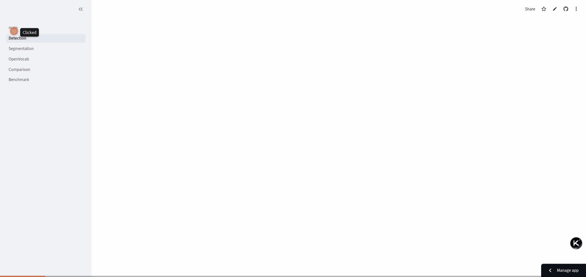

# cv-detection-seg-benchmark

[](https://github.com/andrudebaran7/cv-detection-seg-benchmark/actions/workflows/ci.yml)


[](https://doi.org/10.5281/zenodo.21092319)

Interactive comparison of object **detection** and image **segmentation** models
through a single unified interface, with a Streamlit demo. Built to fit
Streamlit Community Cloud (nano/tiny models only).

**[Live demo →](https://cv-detection-seg-benchmark-au.streamlit.app/)**



_Tour of the five pages, ending with a live latency-vs-mAP benchmark run._

## Models

| Model | Task | Weights | Source |
|-------|------|---------|--------|
| YOLO11n | Detection | `yolo11n.pt` | [ultralytics](https://github.com/ultralytics/ultralytics) |
| RF-DETR-nano | Detection | `RFDETRNano` | [rf-detr](https://github.com/roboflow/rf-detr) |
| YOLO-World | Open-vocabulary detection | `yolov8s-world.pt` | [ultralytics](https://github.com/ultralytics/ultralytics) |
| YOLO11n-seg | Instance segmentation | `yolo11n-seg.pt` | [ultralytics](https://github.com/ultralytics/ultralytics) |
| SAM 2 tiny | Promptable segmentation | `sam2.1_t.pt` | [segment-anything-2](https://github.com/facebookresearch/segment-anything-2) |
| Mask2Former | Panoptic segmentation | `mask2former-swin-tiny-coco-panoptic` | [transformers](https://huggingface.co/facebook/mask2former-swin-tiny-coco-panoptic) |

All models implement the same `models/base.py` interface (`predict() -> Prediction`),
so the app is independent of the concrete model. A later milestone adds RF-DETR-Seg
(see roadmap).

## Pages

- **Detection** — YOLO11n or RF-DETR-nano on an uploaded image.
- **Segmentation** — YOLO11n-seg (automatic), SAM 2 tiny (point-prompted), and
  Mask2Former (panoptic).
- **Open-Vocabulary** — YOLO-World with predefined COCO classes plus free-text classes.
- **Comparison** — run 2–3 detectors side-by-side with a metrics table.
- **Benchmark** — measured on-device latency vs published COCO mAP (scatter + table).

## Quickstart

```bash
python3 -m venv .venv
.venv/bin/pip install -r requirements-dev.txt   # runtime + pytest (CPU torch)
.venv/bin/streamlit run app/main.py
```

Weights download automatically on first use. Two sample images live in
`data/sample_images/`. `requirements.txt` holds the CPU-only runtime deps;
`requirements-dev.txt` adds `pytest` for the test suite.

## Tests

Tests mock the underlying models (no weight downloads), so the suite is fast:

```bash
.venv/bin/python -m pytest -v
```

The documented test count is kept in sync with the suite automatically:
`python tools/update_test_count.py` rewrites it in the docs from a `pytest`
collection, and CI runs the same script with `--check` to block drift.

## Deploy to Streamlit Community Cloud

Streamlit Community Cloud reads `requirements.txt` (Python deps) and `packages.txt`
(system deps) at the repo root. `packages.txt` installs `libgl1` and
`libglib2.0-0t64`, which provide `libGL.so.1` and `libgthread-2.0.so.0` for OpenCV
(pulled in by `ultralytics`) on the headless Debian-trixie Cloud image. On
[share.streamlit.io](https://share.streamlit.io): pick this repo, branch `main`, and
main file path `app/main.py`.

**Memory note:** the free tier provides ~1 GB RAM. The app uses a single-slot model
loader (`app/components/model_runner.py`): only one model is kept in memory at a time, and
eviction calls `gc.collect()` + `malloc_trim` to return freed memory to the OS. The
Comparison and Benchmark pages therefore run detectors one at a time rather than holding
them all. Single-model pages (Detection, Segmentation, Open-Vocabulary) fit comfortably;
the full 3-heavy-detector Comparison/Benchmark can still approach the limit — pick the
lighter detectors or use a paid tier if you hit a resource error.

## Architecture

```
models/base.py        # Prediction dataclass + DetectionSegModel ABC (the contract)
models/yolo_wrapper.py
models/sam2_wrapper.py
models/rfdetr_wrapper.py
models/yoloworld_wrapper.py
models/mask2former_wrapper.py
app/main.py           # Streamlit home
app/pages/            # 1_Detection, 2_Segmentation, 3_OpenVocab, 4_Comparison, 5_Benchmark
app/components/       # model_runner (caching), visualization, comparison, benchmark
```

## Roadmap

- **v0.1** — base structure, YOLO + SAM 2, minimal Streamlit app. ✅
- **v0.2** — RF-DETR (detection), YOLO-World; side-by-side comparison page. ✅
- **v0.3** — Mask2Former (panoptic); benchmark page (latency vs mAP). ✅
- **v1.0** (this release) — portable CPU/GPU measurement harness (`benchmark/`), real
  Tesla T4 campaign, independently-audited corrections, 71 tests, and a Zenodo DOI. ✅
- **v0.4+** (future) — RF-DETR-Seg (once masks return reliably); video input; real-time
  metrics; own accuracy/mAP evaluation; arXiv preprint.

## Companion report

A technical report on the state of the art in detection & segmentation accompanies
this repository (private): `cv-detection-seg-report`.

## Citation

The `v1.0` release is archived on Zenodo: **[10.5281/zenodo.21092319](https://doi.org/10.5281/zenodo.21092319)**.

```bibtex
@software{duarte2026cvbenchmark,
  author  = {Duarte, Sergio},
  title   = {{cv-detection-seg-benchmark}: A Reproducible CPU/GPU Detection and
             Segmentation Benchmark},
  year    = {2026},
  version = {v1.0},
  doi     = {10.5281/zenodo.21092319},
  url     = {https://doi.org/10.5281/zenodo.21092319}
}
```

## License

AGPL-3.0. This project depends on `ultralytics` (AGPL-3.0); commercial use of those
models may require an Ultralytics Enterprise license.
```
